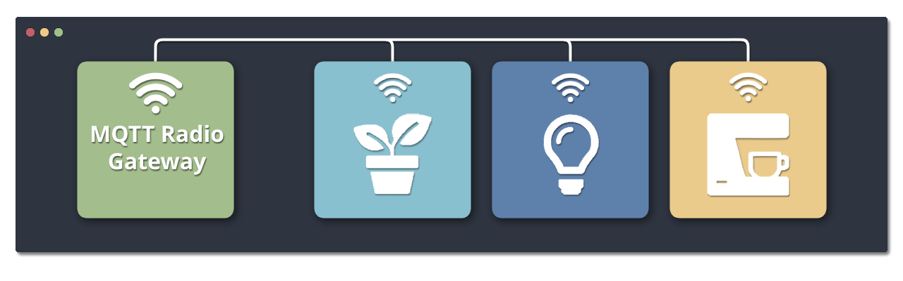
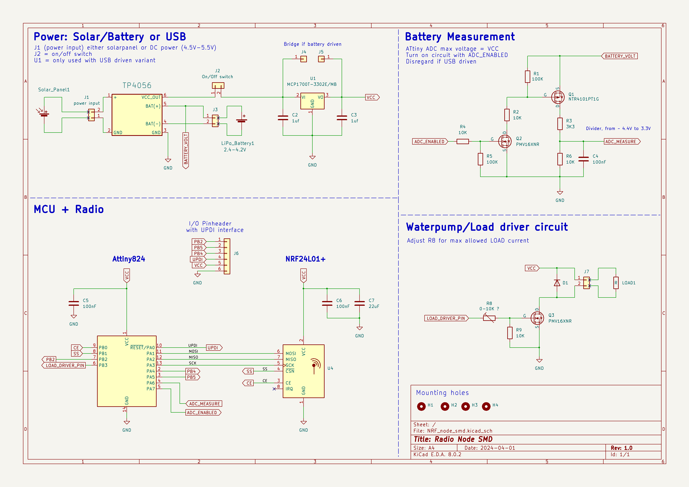
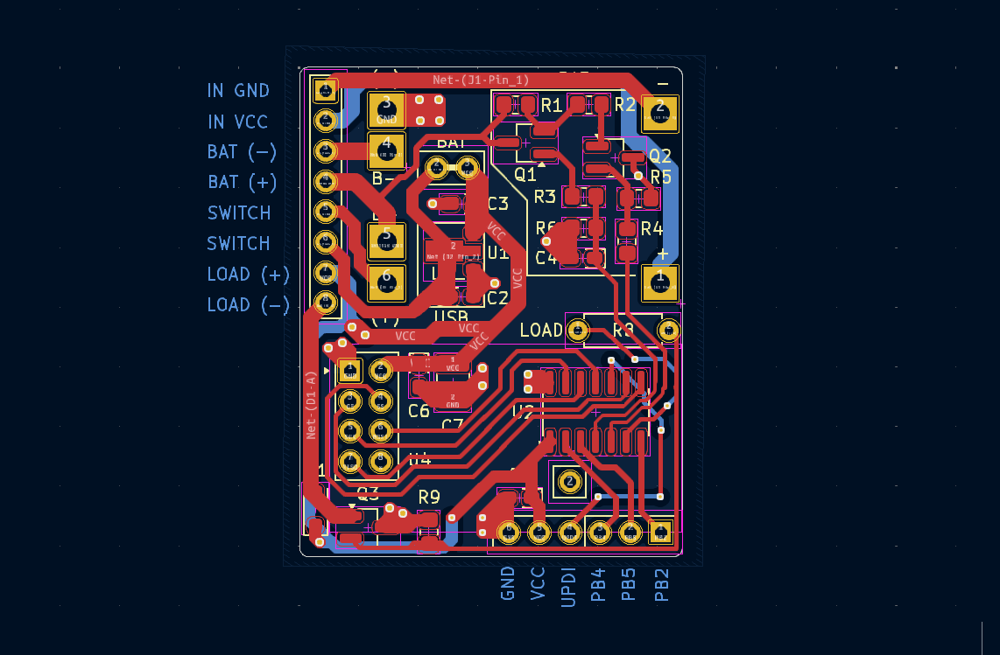
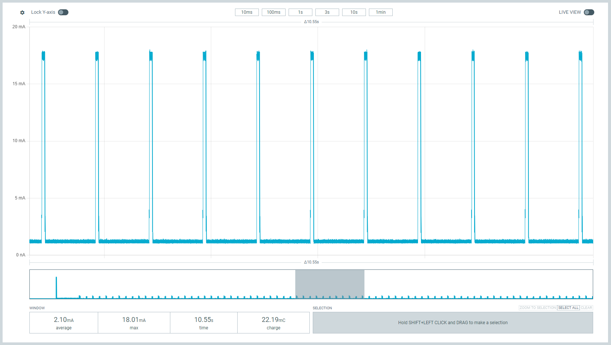
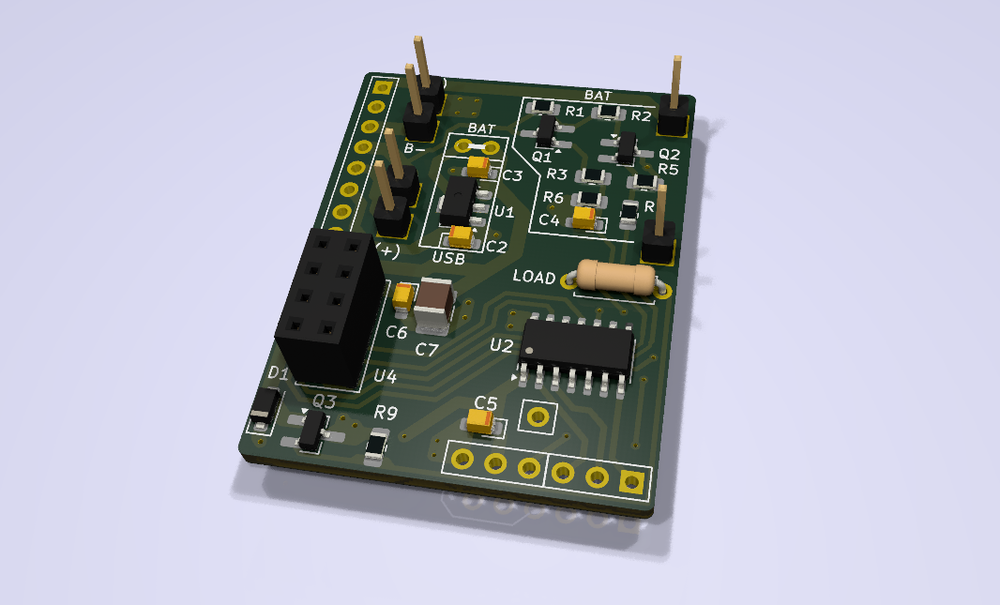
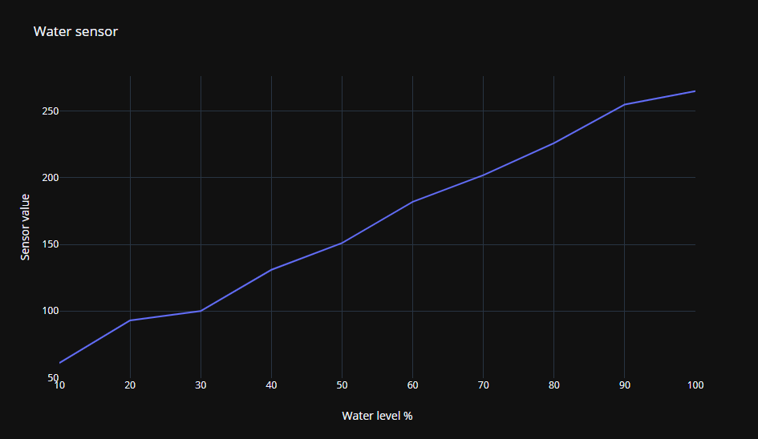

# radio-nodes

Solar/Battery/USB powered wireless "smarhome" modules, based on the Attiny824 microcontroller.  
Serves as the end-node of [MQTT-radio-gateway](https://github.com/Peppson/MQTT-radio-gateway).   
Written in C++ with PlatformIO framework.  

&nbsp;
## Project Overview
- Each node is easily configurable to perform various tasks, such as watering plants,   
turning on the coffeemaker, opening blinds, etc.  

- Power consumption was the main concern when designing this.   
Nodes consumes ∼`2mA` @ 3.3V in active mode, and as low as ∼`3uA` @ 3.3V while deepsleeping!  
Making it possible to power the nodes indefinitely from a small solarpanel.  
Measured and optimized using [Power Profiler Kit II](https://www.nordicsemi.com/Products/Development-hardware/Power-Profiler-Kit-2).  

- This project was primarily made for personal ***"needs"***. But it is open for use by anyone who finds it beneficial.  
Every ***node*** has it's own directory inside `src` and it's own enviroment, selected from `platformio.ini`.

&nbsp;
## Hardware and PCB  
Designed a compact PCB integrating a [TP4056](https://www.amazon.com/TP4056/s?k=TP4056) Li-ion/LiPo battery charger, an [NRF24L01+](https://www.amazon.com/s?k=nRF24L01%2B&crid=1VM0GXMUG7ISX&sprefix=nrf24l01%2B%2Caps%2C145&ref=nb_sb_noss_1) radio,   
and the [Attiny824](https://www.mouser.se/ProductDetail/Microchip-Technology/ATTINY824-SSF?qs=pUKx8fyJudA6%2F%2FVSNIlI1w%3D%3D) AVR microcontroller.  

KiCad files: [📂 _KiCad/](./_KiCad/)  
More images in: [📂 _images/](./_images/)  

    Schematic

  

&nbsp;

  

    PCB layout 

  

&nbsp;
> 2-layer PCB, dimensions 42mm x 31mm.

  

  

    Power consumption in active mode 

  

&nbsp; 
> In active mode, the node toggles its radio `on` for 50ms and `off` for 950ms to minimize power usage.

  

  
#### PCB

#### Hardware

&nbsp;
## Nodes 

    Nodes 1-10: Self watering plants (Solar/USB powered)  

Uses a 3-5V waterpump and DIY capacative fluid-level sensor.  See link below.  
[Liquid Level Sensing Using Capacitive-to-Digital Converters](https://www.analog.com/en/analog-dialogue/articles/liquid-level-sensing-using-cdcs.html)  

The solar-powered variant uses the TP4056 to charge a 3.7V Li-ion/LiPo battery.  
While the USB variant skips that step and plugs directly into 5V (3.3V LDO onboard).  

#### Node 1 hardware:  

&nbsp;  

#### Node 1 water sensor linearity:    

> Sensor (Adc) readings vs water level in %. 

&nbsp;  

    

        Node 11: Mocca Master controller
    

Uses a SG90 servo mounted internally to toggle the `On/Off` button,   
and a hall-effect current sensor, to get the current state.  
> "Looks pretty neat when the button toggles all by itself :)"   

&nbsp;  
